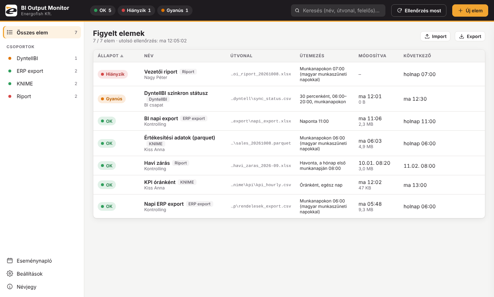
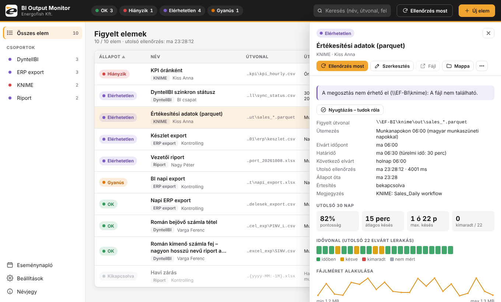
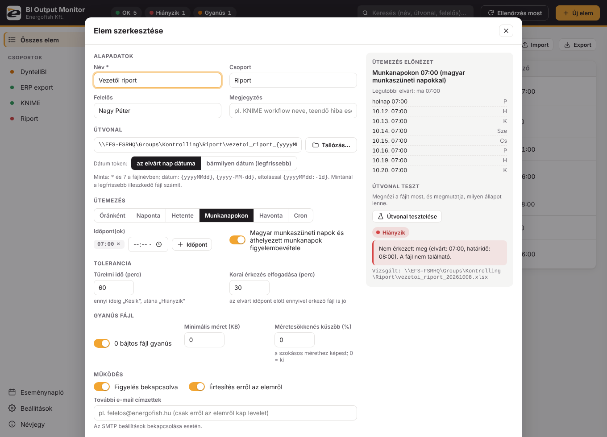
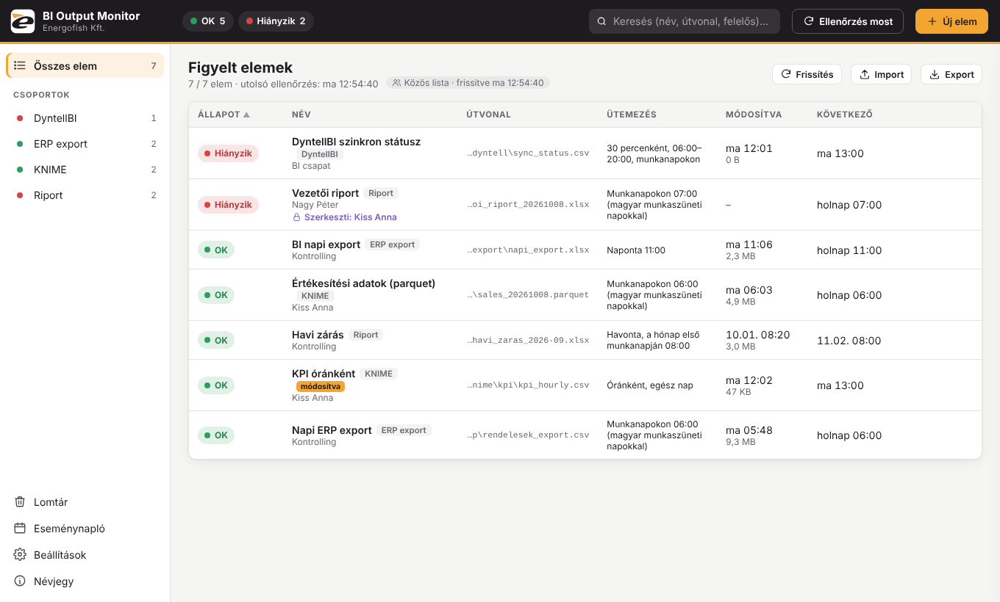
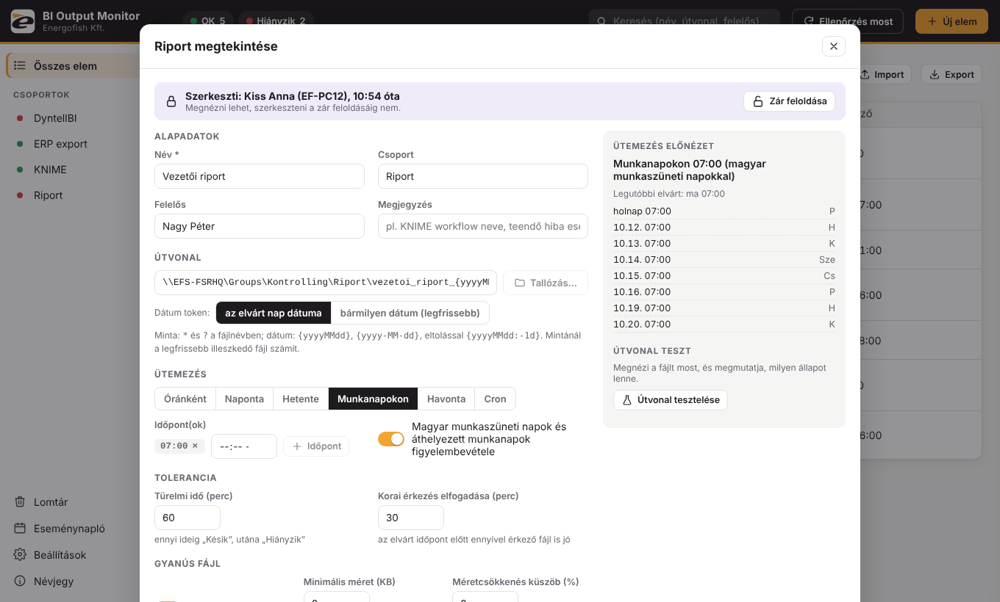
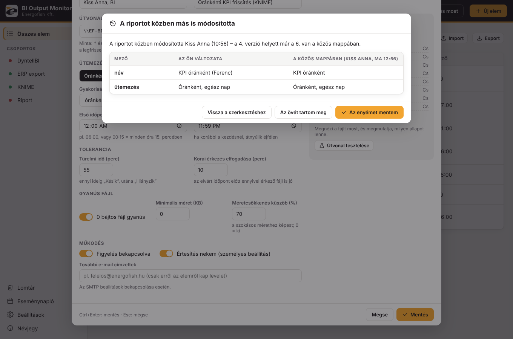

# BI Output Monitor

Windows-os tálcaalkalmazás az Energofish Kft. BI/kontrolling csapatának. Figyeli, hogy az automatizált folyamatok (KNIME batch workflow-k, DyntellBI szinkron, ERP exportok, riportok) kimenetei **időben megérkeztek-e** a hálózati meghajtókra, és szól, ha valami elmaradt.

- egyetlen hordozható `BIMonitor.exe`, telepítő és admin jog nélkül
- a háttérben fut, a tálcaikon színe mutatja az összesített állapotot
- natív Windows értesítések (és opcionálisan e-mail), ismétlés nélkül
- óránkénti, napi, heti, munkanapos (magyar munkaszüneti napokkal), havi és cron ütemezés
- konkrét fájl vagy minta (`sales_*.parquet`, `riport_{yyyyMMdd}.xlsx`)
- előzmények, pontossági statisztika, eseménynapló, közös csapatlista

## ⬇️ Letöltés

**Mindig a legfrissebb verzió:** <https://github.com/vferenc-creator/bi_check/releases/latest>
(közvetlen link az exe-re: <https://github.com/vferenc-creator/bi_check/releases/latest/download/BIMonitor.exe>)

Minden sikeres build után automatikusan új kiadás készül (`BIMonitor.exe` + `BIMonitor_minta_elemek.json` mintalista).



| Részletek, előzmények, statisztika | Szerkesztő ütemezés-előnézettel és útvonalteszttel |
|---|---|
|  |  |

---

## Tartalom

1. [Telepítés](#telepítés)
2. [Első lépések](#első-lépések)
3. [Útvonalak és minták](#útvonalak-és-minták)
4. [Ütemezések](#ütemezések)
5. [Állapotok](#állapotok)
6. [Értesítések](#értesítések)
7. [Előzmények és statisztika](#előzmények-és-statisztika)
8. [Közös mód (csapat)](#közös-mód-csapat) · [Import/export](#importexport)
9. [E-mail és napi összefoglaló](#e-mail-és-napi-összefoglaló)
10. [Munkanaptár](#munkanaptár)
11. [Hol vannak a beállítások?](#hol-vannak-a-beállítások)
12. [Parancssori kapcsolók](#parancssori-kapcsolók)
13. [Hibaelhárítás](#hibaelhárítás)
14. [Fejlesztőknek](#fejlesztőknek)

---

## Telepítés

1. Töltse le a `BIMonitor.exe`-t a [legfrissebb kiadásból](https://github.com/vferenc-creator/bi_check/releases/latest), és másolja egy állandó helyre, például `%LOCALAPPDATA%\Programs\BIMonitor\BIMonitor.exe` vagy `C:\Tools\BIMonitor\`. Ne a Letöltések mappából futtassa, mert az automatikus indítás erre az útvonalra mutat.
2. Indítsa el. Az első indításkor:
   - létrejön a `%APPDATA%\EnergofishMonitor\settings.json`;
   - bekapcsol az **Indítás a Windows-zal** (kikapcsolható a Beállításokban vagy a tálcamenüben).
3. Kész. Az ablak bezárásakor (X) a program a tálcán fut tovább. Kilépni a tálcaikon jobb gombos menüjéből lehet.

**Követelmények:** Windows 10 vagy 11, valamint a Microsoft Edge **WebView2 Runtime**. Ez Windows 11-en és a frissített Windows 10-eken alapból megvan. Ha mégis hiányzik, a program szól és felajánlja a letöltést; a figyelés és az értesítések addig is működnek.

**SmartScreen / víruskereső:** az exe nincs digitálisan aláírva, ezért első indításkor megjelenhet a „A Windows megvédte a számítógépet” ablak. Ilyenkor: *További információ → Futtatás mindenképp*. Céges terítéshez érdemes a belső kódaláíró tanúsítvánnyal aláírni (`signtool sign …`).

**Frissítés:** lépjen ki a programból a tálcamenüben, cserélje le az exe-t, majd indítsa újra. A beállítások és az előzmények megmaradnak.

**Eltávolítás:** a Beállításokban kapcsolja ki az *Indítás a Windows-zal* opciót, lépjen ki, és törölje az exe-t, valamint (ha kell) a lent felsorolt adatmappákat.

---

## Első lépések

1. **Új elem** (jobb felső gomb vagy `Ctrl+N`).
2. **Név**, **csoport** (pl. KNIME, DyntellBI, ERP export, Riport), **felelős**, **megjegyzés** (pl. melyik workflow állítja elő, mi a teendő hiba esetén).
3. **Útvonal:** írja be a UNC útvonalat (`\\EFS-FSRHQ\Groups\BI\export.xlsx`), vagy válassza ki a **Tallózás…** gombbal.
4. **Ütemezés:** válassza ki a típust. A jobb oldali **Ütemezés előnézet** azonnal mutatja a következő elvárt időpontokat, így rögtön látszik, ha valami rosszul van beállítva (cron, ünnepnapok).
5. **Útvonal tesztelése:** megnézi a fájlt most, és megmutatja, milyen állapot lenne.
6. **Felvétel**. Az elem azonnal ellenőrzésre kerül.

A listában egy sorra kattintva megnyílik a **részletpanel**: indoklás, elvárt időpont, határidő, a talált fájl, előzmények, statisztika. Dupla kattintás: szerkesztés.

Hasznos billentyűk: `F5` minden elem ellenőrzése most · `Ctrl+N` új elem · `Ctrl+F` keresés · `Esc` panel vagy ablak bezárása · `Ctrl+Enter` mentés a szerkesztőben.

---

## Útvonalak és minták

### UNC és csatolt meghajtók
A program **mindig UNC útvonallal dolgozik**, mert a meghajtóbetűk felhasználónként eltérnek. Ha csatolt meghajtóról ad meg vagy tallóz fájlt (`M:\BI\export.xlsx`), automatikusan átalakítja (`\\EFS-FSRHQ\Groups\BI\export.xlsx`); az átalakítás a `WNetGetConnection` Windows-hívással történik. Helyi útvonal (`C:\…`) is használható, erre a program figyelmeztet.

### Minták
| Írásmód | Jelentés |
|---|---|
| `\\EF-BI\exports\sales_*.parquet` | a mintára illeszkedő **legfrissebb** fájl számít |
| `riport_??.xlsx` | `?` = pontosan egy karakter |
| `riport_{yyyyMMdd}.xlsx` | az **elvárt nap dátuma** kerül a helyére (pl. `riport_20261008.xlsx`) |
| `napi_{yyyy-MM-dd:-1d}.csv` | eltolással: az elvárt nap előtti nap (tegnapi adat) |
| `\\EF-BI\out\{yyyy}\{MM}\x.csv` | dátumozott mappák (a tokenek mappanévben is működnek) |
| `havi_{yyyy-MM:-1M}.xlsx` | előző hónap |

- Tokenek: `yyyy`, `yy`, `MM`, `M`, `dd`, `d`, `HH`, `H`, `mm`, köztük tetszőleges elválasztóval.
- Eltolás egységei: `d` (nap), `w` (hét), `M` (hónap), `y` (év), `h` (óra), `m` (perc). Például `:-1d`, `:+2h`.
- `*` és `?` csak a fájlnévben használható, a mappanévben nem.
- A kis- és nagybetű nem számít (mint a Windowsban).
- **Dátum token mód** a szerkesztőben: *„az elvárt nap dátuma”* (alapértelmezett) vagy *„bármilyen dátum (legfrissebb)”*. Az utóbbinál a token tetszőleges számjegyekre illeszkedik.
- Ha a tallózott fájl neve dátumot tartalmaz (`riport_20261008.xlsx`), a szerkesztő felajánlja a mintás változatot is.

### Mikor számít „megérkezettnek”?
A lerakás időpontja a fájl **módosítási ideje** (LastWriteTime). A kérdés: *a legutóbbi elvárt időpont után módosult-e a fájl?*

- **Korai érkezés elfogadása (perc):** ha a folyamat 05:50-re végez, de 06:00 az elvárt időpont, a 30 perces korai tolerancia miatt ez is jó. Biztonsági korlát: legfeljebb az előző elvárt időpont és a mostani közötti felezőpontig visszamenőleg fogad el fájlt, így egy fájl sosem „teljesít” két egymást követő elvárást.
- **Türelmi idő (perc):** az elvárt időpont után ennyi ideig *Késik*, utána *Hiányzik*.

---

## Ütemezések

Minden számítás magyar idő (Europe/Budapest) szerint történik.

| Típus | Beállítások | Példa |
|---|---|---|
| **Óránként** | gyakoriság (15 perc – 12 óra), kezdés, vége, napok (minden nap / hétköznap / munkanap / kiválasztott napok) | óránként 06:00–20:00, munkanapokon |
| **Naponta** | egy vagy több időpont | naponta 06:00 és 14:30 |
| **Hetente** | napok + időpontok | hétfőn és csütörtökön 07:00 |
| **Munkanapokon** | időpontok; magyar munkaszüneti napok figyelembevétele (be/ki) | munkanapokon 06:00 |
| **Havonta** | a hónap N. napja / utolsó napja / első / N. / utolsó munkanapja | minden hónap első munkanapján 08:00 |
| **Cron** | 5 mezős kifejezés (perc óra nap hónap hétnapja), `@daily`, `@hourly` | `0 6 * * 1-5`, `*/15 8-17 * * *` |

**Munkaszüneti napon** (napi, heti, havi „N. nap” és cron esetén): *nem számít* / *nincs elvárás* / *a következő munkanapra tolódik* / *az előző munkanapra kerül*.

**Határesetek** (mindegyikre van unit teszt):
- **Éjfélen átnyúló óránkénti ablak** (pl. 22:00–02:00): az éjfél utáni rész ahhoz a naphoz tartozik, amelyiken az ablak kezdődött. Így a „munkanapokon 22:00–02:00” pénteken szombat hajnalig tart, vasárnap éjjel viszont nem indul.
- **Nyári időszámítás kezdete** (március, 02:00 → 03:00): a nem létező időpont (pl. 02:30) a rés utáni első érvényes pillanatra, 03:00-ra kerül. Ezen a napon óránként 23 elvárt időpont van.
- **Téli időszámítás kezdete** (október, a 02:xx kétszer van): a kétszer előforduló időpont csak egyszer, az első alkalommal számít.
- A türelmi idő valós időtartam, ezért éjfélen és időszámítás-váltáson át is helyesen működik.
- Hónap 31-e rövidebb hónapban: az utolsó nap; február 29. szökőévben.

---

## Állapotok

| Állapot | Jelentés | Tálcaikon |
|---|---|---|
| **OK** | a fájl az utolsó elvárt időpont után megérkezett | zöld |
| **Várakozik** | még nem volt elvárt időpont | zöld |
| **Késik** | még nem jött meg, de a türelmi időn belül vagyunk | sárga |
| **Gyanús** | megérkezett, de 0 bájtos / a minimumnál kisebb / a szokásosnál drasztikusan kisebb (a legutóbbi érkezések mediánjához képest) / jövőbeli dátumú | sárga |
| **Hiányzik** | a türelmi idő lejárt, nem jött meg | piros |
| **Elérhetetlen** | hálózati hiba, a szerver vagy a megosztás nem érhető el, jogosultsági hiba, időtúllépés | piros |
| **Kikapcsolva** | ideiglenesen kikapcsolt elem | – |

Hálózati hiba esetén az elem **soha nem „Hiányzik”**, hanem „Elérhetetlen”.

- **Időkorlát:** minden fájlművelet külön szálon fut időkorláttal (alapból 10 s), így a felület lassú megosztás esetén sem fagy le.
- **Szerverenkénti megszakító:** ha például a `\\EFS-FSRHQ` nem válaszol, a program 30 mp-ig (ismétlődő hibánál egyre tovább, legfeljebb 5 percig) nem próbálkozik újra, és az összes ottani elemet „Elérhetetlen”-nek jelöli. Ilyenkor a lista tetején egy sáv jelzi a kiesést. Az „Ellenőrzés most” azonnal újrapróbálja.
- **Mappa vagy megosztás:** ha a mappa nem létezik, de maga a megosztás elérhető, az eredmény „Hiányzik (a mappa nem létezik)”. Ha a megosztás sem érhető el, „Elérhetetlen”.

Az ellenőrzés alapból percenként fut, és ezen felül pontosan az elvárt időpontban és a határidő lejártakor is.

---

## Értesítések

A program natív Windows-értesítéseket küld. Ezek a tálcaikonon keresztül jelennek meg, és bekerülnek az Értesítési központba. Az értesítésre kattintva megnyílik az ablak.

- **Nem spamel:** egy problémáról (elem + elvárt időpont + állapot) egyszer szól. Ez **újraindítás után is így marad**, mert a már jelzett problémákat az adatbázis tárolja. Ha a hálózat ingadozik (Hiányzik ↔ Elérhetetlen), nem ismétel.
- **Helyreállás:** ha egy jelzett probléma megoldódik, szól, hogy helyreállt (kikapcsolható).
- **Összevonás:** a pár másodpercen belül érkező problémákból egy értesítés lesz („3 új probléma”). Szerverkiesésnél: „EFS-FSRHQ nem érhető el (12 elem)”.
- **Késésről is szóljon:** alapból csak a hibákról (Hiányzik, Elérhetetlen, Gyanús) jön értesítés; a Késik állapotról ez a kapcsoló bekapcsolása után.
- **Csendes időszak** (pl. 22:00–06:00, hétvégén egész nap is): ilyenkor nincs értesítés. A végén egyetlen összefoglaló jön a még nyitott problémákról.
- **Szüneteltetés** a tálcamenüből: 1 órára vagy holnap reggelig.
- **Elemenként** kikapcsolható (szerkesztő → *Értesítés erről az elemről*).
- **Nyugtázás** („tudok róla”): az adott problémáról a következő elvárt időpontig nem szól újra.
- A Windows *Fókuszsegéd / Ne zavarjanak* módját a program tiszteletben tartja.

---

## Előzmények és statisztika

A részletpanelen elemenként az utolsó 30 napra:
- **pontosság** (időben érkezett / mért elvárások), **átlagos** és **legnagyobb késés**, **kimaradt** lerakások;
- **idővonal:** minden elvárt lerakás egy kocka (zöld = időben, sárga = késve, piros = kimaradt, szürke = nem mért);
- **fájlméret-grafikon** és **eseménylista** (új fájlverziók, állapotváltozások).

A „nem mért” azt jelenti, hogy a program akkor nem futott (például ki volt kapcsolva a gép). Ezek nem számítanak kimaradásnak.

Az **Eseménynapló** (bal oldali menü) az összes elem állapotváltozását mutatja az elmúlt 7 napra. Az előzmények megőrzési ideje a Beállításokban állítható (alapból 180 nap).

---

## Közös mód (csapat)

Közös módban a figyelt riportok listája **egy hálózati mappában** van (pl. `\\EFS-FSRHQ\Groups\BI\BI_Check_kozos`). Bárki felvehet, szerkeszthet vagy törölhet riportot, és ezt a többi gépen futó példány is látja és figyeli.

| Ferenc gépe: Anna épp szerkeszti a „Vezetői riportot”, a „KPI”-t módosította | Zárolt riport megnyitása: csak megtekintés |
|---|---|
|  |  |

**Bekapcsolás:** *Beállítások → Közös mód (csapat)*.
1. Adja meg a mappát kézzel, vagy a **Tallózás** gombbal. A csatolt meghajtót (`M:\…`) a program UNC-re alakítja.
2. Az **Ellenőrzés** gomb megnézi, hogy a mappa elérhető-e, írható-e, és hogy a zárolás működik-e rajta. Üres mappát a program előkészít.
3. **Közös mód bekapcsolása** után a program felajánlja a saját riportok átmásolását. Ha egy riport már szerepel a közös listában (azonos azonosítóval vagy útvonallal), elemenként lehet választani: *kihagyás / másolás új riportként / a közös felülírása*. A saját lista nem törlődik: közös módban rejtve marad, kikapcsoláskor visszajön.

**Mi közös és mi személyes?**

| Közös (a közös mappában) | Személyes (a saját gépen) |
|---|---|
| a riportok összes beállítása (útvonal, ütemezés, türelmi idő, gyanússági szabályok, csoport, felelős, megjegyzés, extra e-mail címzettek), a figyelés be/ki kapcsolása, a **munkanaptár** | **kiről kér értesítést** (riportonként a részletpanelen, csoportonként a *Beállítások → Értesítések* alatt), csendes időszak, szünet, automatikus indulás, ablak, SMTP, napi összefoglaló, nyugtázás, előzmények |

**Szerkesztés és zárolás**
- Amikor valaki megnyit egy riportot szerkesztésre, a riport a többiek számára **zárolt**. Náluk lakat ikon és „Szerkeszti: Kiss Anna (EF-PC12), 10:42 óta” felirat látszik. Megnézni lehet, szerkeszteni nem.
- A zár feloldódik mentéskor, a Mégse gombra, az ablak bezárásakor és kilépéskor.
- **Elárvult zár:** lefagyott program, kikapcsolt gép vagy megszakadt hálózat esetén a zár életjele nem frissül. A beállítható ideje (alapból 10 perce) nem frissült zár lejártnak számít, és a következő szerkesztő automatikusan átveszi. A saját, összeomlás előtti zárát a program induláskor azonnal feloldja.
- **Kézi „Zár feloldása”:** megerősítést kér, és bekerül a riport változásnaplójába.
- **Ütközés:** ha a riport a megnyitás óta megváltozott a közös mappában (például feloldották a zárat és más mentett), a program nem írja felül csendben. Megmutatja a mezőnkénti eltérést, és rákérdez: *Az enyémet mentem / Az övét tartom meg / Vissza a szerkesztéshez*.
- A figyelés zárolás alatt is fut, az utolsó mentett definícióval.



**Változások követése**
- A program beállítható időközönként (alapból 30 mp-enként) újraolvassa a közös mappát. A **Frissítés** gombbal azonnal is lehet.
- Mások változtatásairól diszkrét jelzés jön („Új riport: X – felvette: Y”), a listában pedig „új / módosítva” címke. Kérésre Windows-értesítés is jöhet.
- **Lomtár:** a törölt riport a lomtárba kerül (ki és mikor törölte), onnan visszaállítható vagy véglegesen törölhető.
- **Változásnapló** riportonként a részletpanelen: ki, mikor, gépről, mit módosított (mezők szerint).

**Offline mód:** ha a közös mappa nem érhető el, a program a legutóbb beolvasott lista helyi gyorsítótárával figyel tovább. A szerkesztés ilyenkor tiltott, és egy sáv jelzi az offline állapotot. Amikor a mappa újra elérhető, a program automatikusan frissít.

**Programverziók:** a közös mappában lévő `bicheck.json` tárolja a formátum verzióját. Ha a mappát egy újabb programverzió kezeli, a régebbi csak olvasni tudja, és jelzi, hogy frissíteni kell. Közös módban ezért érdemes egyszerre frissíteni.

**Hogyan van megoldva (a mappa tartalma)**
```
bicheck.json          formátumverzió (ne törölje)
calendar.json         közös munkanaptár
reports\<azonosító>.json   egy riport = egy fájl (verziószám, létrehozó, módosító, lomtár-jelölés, változásnapló)
locks\<azonosító>.lock     szerkesztési zár (ki, melyik gépen, mióta; az életjel a fájl dátuma)
```
- Adatbázis szándékosan nincs: SMB-n az adatbázisfájlok zárolása nem megbízható.
- Minden írás ideiglenes fájlba történik, majd egy lépésben a végleges névre cserélődik, így a másik gép soha nem olvas félig megírt fájlt.
- A zárat a program „csak ha még nem létezik” módon hozza létre. Ezt a fájlszerver dönti el, ezért ketten sosem kaphatják meg egyszerre.
- Két valódi gépen elvégzendő kézi tesztek: [docs/kozos-mod-kezi-teszt.md](docs/kozos-mod-kezi-teszt.md).

## Import/export

**Export / import** (lista fejléce vagy Beállítások → Adatok):
- **JSON:** teljes, visszatölthető formátum.
- **CSV:** pontosvesszővel tagolt, UTF-8, Excelben közvetlenül megnyitható. Szerkeszthető, majd visszaimportálható.
- Importáláskor előnézet látható: az azonos azonosítójú vagy azonos útvonalú elemek **frissülnek**, a többi **új** elem lesz, a hibás sorokat a program jelzi. Közös módban az import a közös listába kerül.

---

## E-mail és napi összefoglaló

**E-mail (SMTP)** – Beállítások → E-mail értesítés:
- szerver, port, titkosítás (STARTTLS / TLS / nincs), felhasználónév és jelszó (belső relay esetén üresen hagyható), feladó, címzettek (pontosvesszővel elválasztva);
- a jelszót a program **Windows DPAPI**-val titkosítva tárolja: csak ugyanaz a felhasználó tudja visszafejteni ugyanazon a gépen;
- elemenként további címzettek is megadhatók (szerkesztő → *További e-mail címzettek*), ők csak az adott elemről kapnak levelet;
- a **Próbaüzenet** gombbal kipróbálható;
- a csendes időszak az e-mailekre nem vonatkozik.

**Napi összefoglaló:** minden nap egyszer, a megadott időpont után (opcionálisan csak munkanapokon). Windows-értesítésként és/vagy HTML-táblázatos e-mailként érkezik, és beállítható, hogy csak probléma esetén küldjön.

---

## Munkanaptár

**Beépítve:**
- a munkaszüneti napok: jan. 1., márc. 15., nagypéntek, húsvét, máj. 1., pünkösd, aug. 20., okt. 23., nov. 1., dec. 25–26.;
- az **áthelyezett munkanapok** 2025-re és 2026-ra. 2026-ban: jan. 2. pihenőnap / jan. 10. munkanap; aug. 21. pihenőnap / aug. 8. munkanap; dec. 24. pihenőnap / dec. 12. munkanap.

> **Évente frissíteni kell!** Az áthelyezéseket az NGM-rendelet minden évben újra meghatározza. A *Beállítások → Munkanaptár* kártyán bármelyik nap felvehető (pihenőnap vagy munkanap), és a beépített napok közül bármelyik figyelmen kívül hagyható, újrafordítás nélkül.
>
> 2026 őszén törvényjavaslat van a parlament előtt, amely december 24-ét munkaszüneti nappá tenné. Ha elfogadják, ellenőrizze a december 12-i szombati munkanapot.

A kódban az évenkénti adatok helye: `internal/calendar/transfers.go`.

Közös módban a munkanaptár saját kiegészítései is közösek (`calendar.json` a közös mappában), így minden gép ugyanazokat a munkanapokat látja.

---

## Hol vannak a beállítások?

| Hely | Tartalom |
|---|---|
| `%APPDATA%\EnergofishMonitor\settings.json` | beállítások és figyelt elemek (JSON, emberileg olvasható; vándorló profillal együtt költözik) |
| `%APPDATA%\EnergofishMonitor\settings.json.bak` | az előző mentés |
| `%LOCALAPPDATA%\EnergofishMonitor\history.db` | előzmények (SQLite): érkezések, állapotváltozások, futási idő |
| `%LOCALAPPDATA%\EnergofishMonitor\logs\monitor.log` | napló (5 MB-onként forgatva) |
| `%LOCALAPPDATA%\EnergofishMonitor\WebView2\` | a felület böngészőmotorjának gyorsítótára |
| `%LOCALAPPDATA%\EnergofishMonitor\shared-cache.json` | közös módban a közös lista helyi másolata (offline működéshez) |
| `HKCU\Software\Microsoft\Windows\CurrentVersion\Run\EnergofishBIMonitor` | automatikus indítás |
| *közös mappa* (közös módban) | a riportdefiníciók, zárak, munkanaptár – lásd [Közös mód](#közös-mód-csapat) |

A beállítások a roaming `APPDATA` alatt vannak, mert kicsik és a felhasználóhoz tartoznak. Az előzmények és a gyorsítótár a gépenkénti `LOCALAPPDATA` alatt vannak, mert SQLite adatbázist nem szabad vándorló profilban tartani.

Ha a `settings.json` megsérül, a program nem írja felül: `settings.json.hibas-<időbélyeg>` néven félreteszi, és alapértékekkel indul.

---

## Parancssori kapcsolók

```
BIMonitor.exe                 indítás (ha már fut, előhozza a futó példány ablakát)
BIMonitor.exe --minimized     indítás csak a tálcán (ezt használja az automatikus indítás)
BIMonitor.exe --data-dir X    a %APPDATA%/%LOCALAPPDATA% helyett az X mappát használja (teszteléshez)
BIMonitor.exe --debug         a felületen elérhetők a fejlesztői eszközök (F12)
BIMonitor.exe --selftest F    automata füstteszt: megnyitja a felületet, „ok”-t ír F-be és kilép (CI)
```

Egyszerre csak egy példány fut: a második indítás csak előhozza az elsőt.

---

## Hibaelhárítás

- **Nem jelennek meg értesítések:** próbálja ki a *Beállítások → Próbaértesítés* gombot. Ellenőrizze a Windows *Beállítások → Rendszer → Értesítések* oldalán, hogy a „BI Output Monitor” engedélyezve van-e, és hogy nincs-e bekapcsolva a *Ne zavarjanak* mód. A tálcamenüben azt is nézze meg, nincs-e szüneteltetve.
- **Minden elem „Elérhetetlen”:** hálózati vagy VPN-probléma, illetve a szerver nem érhető el. A lista tetején látszik, melyik szerver esett ki. Nézze meg Intézőben, elérhető-e az útvonal.
- **„Hozzáférés megtagadva”:** a bejelentkezett felhasználónak nincs olvasási joga a mappához.
- **Rossz időpontok:** nézze meg a szerkesztő ütemezés-előnézetét és a munkanaptárat.
- **Közös mód – „Szerkeszti: X”, de X már nem szerkeszti:** ha az életjel 10 perce nem frissült, a zár magától lejár. Ha sürgős, a *Zár feloldása* gombbal azonnal feloldható (ez naplózódik).
- **Közös mód – offline sáv:** a közös mappa nem érhető el (VPN, hálózat, jogosultság). A figyelés közben fut tovább, visszatéréskor automatikusan frissül.
- **Közös mód – „újabb programverzió kezeli”:** frissítse a BI Monitort a [legfrissebb kiadásra](https://github.com/vferenc-creator/bi_check/releases/latest).
- **Napló:** `%LOCALAPPDATA%\EnergofishMonitor\logs\monitor.log`.

---

## Fejlesztőknek

### Technológia és indoklás
- **Go** (1.24) a backendhez: egyetlen statikus exe, kicsi memóriaigény, kiváló párhuzamosság a hálózati ellenőrzésekhez. Cgo nélkül, így bármilyen OS-ről fordítható Windowsra.
- **WebView2** felület (`github.com/jchv/go-webview2/pkg/edge`, tiszta Go) **vanilla JS/CSS** frontenddel, build lépés nélkül. Az ablak csak megnyitáskor jön létre és bezáráskor felszabadul, így a háttérben nem fogyaszt böngészőmemóriát.
- **Saját Win32 réteg** (`golang.org/x/sys/windows`): tálcaikon, menü, fájlválasztó, registry, `WNetGetConnection`, DPAPI, egypéldányos futás. Nincs harmadik féltől származó tálcakönyvtár, ami ütközne az üzenetkezelő ciklussal.
- **Adattárolás:** `settings.json` (atomikus írás) a beállításokhoz, **SQLite** (`modernc.org/sqlite`, tiszta Go) az előzményekhez.
- A JS ↔ Go kommunikáció WebView2 üzenetekkel történik, nincs helyi HTTP port, így tűzfal-felugró ablak sincs.

### Könyvtárszerkezet
```
branding/            ★ arculat EGY helyen: brand.json (név, színek), icon.png
cmd/bimonitor/       a Windows alkalmazás belépési pontja
cmd/devserver/       a valódi mag + felület böngészőben (fejlesztés, képernyőképek)
internal/schedule/   ★ ütemezés-kiértékelő (Prev/Next, DST, cron) – unit tesztekkel
internal/calendar/   magyar munkanaptár (ünnepek, húsvét, áthelyezések)
internal/pathpattern/ minták és dátum tokenek
internal/checker/    fájlellenőrzés: timeout, szerverenkénti circuit breaker, hibaosztályozás
internal/status/     állapot-kiértékelés (OK/Késik/Hiányzik/Elérhetetlen/Gyanús)
internal/engine/     háttérütemező: mikor mit kell ellenőrizni
internal/notify/     értesítési szabályok (ismétlésgátlás, csendes időszak, összevonás)
internal/mailer/     SMTP küldés
internal/store/      settings.json + history.db
internal/teamstore/  ★ közös mód: riportfájlok, zárolás, ütközéskezelés, offline gyorsítótár – párhuzamos tesztekkel
internal/app/        platformfüggetlen alkalmazásmag + a felület RPC API-ja
internal/desktop/    Windows héj: tálca, WebView2 ablak, értesítések
internal/winapi/     Win32 hívások
web/                 index.html, styles.css, app.js (go:embed-del az exe-be kerül)
tools/genres/        ikon, manifest, verzióinfó → .syso (a brandingből)
tools/genicon/       az ikon vektoros újrarajzolása
```

### Build
```powershell
.\build.ps1 -Version 1.0.0      # Windows
./build.sh 1.0.0                # Linux/macOS (keresztfordítás)
```
Az eredmény a `dist\BIMonitor.exe`. A build előbb lefuttatja a `tools/genres`-t, ami a `branding/` alapján legenerálja az exe-be ágyazott ikont, a manifestet (PerMonitorV2 DPI, asInvoker) és a verzióinfót.

### Kiadások (Releases)
A `.github/workflows/build.yml` minden pushnál tesztel és buildel. A fő (alapértelmezett) ágra érkező, minden ellenőrzésen átment push után **automatikusan GitHub Release készül** „Latest” jelöléssel:
- verziószám: a `VERSION` fájl (pl. `1.0`) + a build sorszáma → `v1.0.17`;
- csatolmányok: `BIMonitor.exe` és a `docs/BIMonitor_minta_elemek.json` mintalista;
- a kiadási megjegyzés sablonja: `.github/release-notes.md`, a változáslista az előző kiadás óta érkezett commitokból készül.

Új fő/alverziónál (pl. 1.1) elég a `VERSION` fájlt átírni.

### Tesztek
```
go test ./...            # unit tesztek (ütemező, naptár, minták, checker, állapot, motor, értesítés, tárolás, app)
go test -race ./...
```
A GitHub Actions minden pushnál lefuttatja a teszteket Linuxon és Windowson is. Lefordítja az exe-t, majd **valódi Windows-gépen elindítja** (`--selftest`), és ellenőrzi, hogy a tálca, a WebView2 ablak és a JS–Go híd működik. Az exe letölthető artefaktként.

### Felület fejlesztése böngészőben
```
go run ./cmd/devserver -data ./devdata          # http://127.0.0.1:8787/
go run ./cmd/devserver -data ./devdata -seed    # 30 napnyi kitalált előzménnyel (demó)
```

### Arculat cseréje
- **Ikon:** cserélje le a `branding/icon.png` fájlt (négyzetes, legalább 256×256 px, átlátszó háttér is lehet), majd buildeljen újra. Ebből készül az exe ikonja, az ablak és a tálca ikonja (a tálcán állapotjelző pöttyel), valamint a felület logója. A jelenlegi ikon az Energofish logó vektoros újrarajzolása (`go run ./tools/genicon`); ha megvan az eredeti grafika, egyszerűen írja felül vele.
- **Színek, név:** `branding/brand.json`. A felület minden színe ebből CSS-változóként kerül be, a CSS-ben nincs beégetett márkaszín.

### Továbbfejlesztési tippek
- **Új ütemezéstípus:** `internal/schedule/spec.go` (mezők), `schedule.go` (`Compile`, `baseDay` / `occurrencesOn`), `describe.go` (magyar leírás), tesztek; a felületen a `renderSchedule()` az `app.js`-ben.
- **Új RPC hívás:** `a.register("nev", func(p Param) (Eredmeny, error) {...})` az `internal/app` csomagban; JS-ből `await api("nev", param)`.
- **Új állapotszabály** (pl. tartalomellenőrzés): `internal/status/evaluate.go`.
- Ötletek: Teams webhook értesítés, függőségek (ha A hiányzik, B-ről ne külön szóljon), tartalomellenőrzés (sorok száma, Excel munkalap), kódaláírás a CI-ban.
